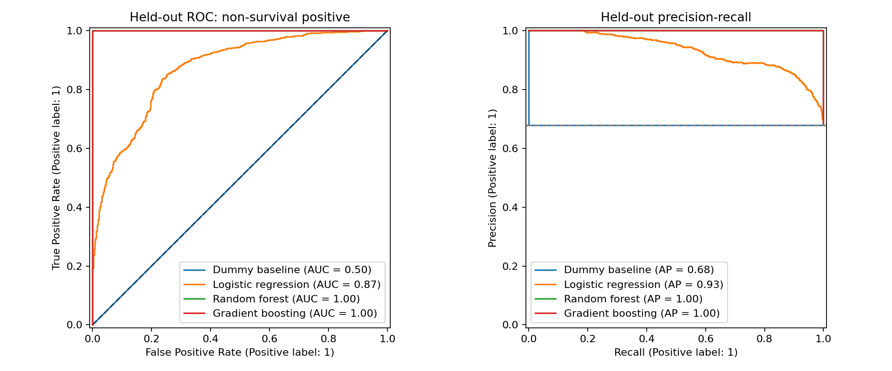

# Evaluation report

## Objective and outcome definition
Predict the supplied survival outcome. Assume `Survive=1/Yes` means survived and `0/No` means did not survive. Internally, non-survival is positive, so risk recall measures detection of non-survivors. The CSV has no data dictionary, follow-up duration or censoring indicator. These are classification estimates, not survival times or probabilities at a defined clinical horizon. Confirm label meaning with the dataset owner before interpreting clinically.

## Data quality
There are 15,000 rows, 14,042 IDs, 4,815 survival labels and 10,185 non-survival labels. 430 negative ages are set missing, not converted to positive ages. Creatinine has 499 missing values. Whitespace/case and ejection-fraction abbreviations are normalized. Nonpositive numeric measurements and ages above 120 are treated as invalid; no additional physiological cutoffs are guessed without units.

375 IDs have conflicting outcomes. Records are retained because timestamps/provenance are unavailable; repeated IDs and exact cleaned predictor copies are joined into groups. Grouping mitigates overlap, but cannot resolve label ambiguity or establish that all records are independent patients. ID is excluded as a predictor. Favorite color is excluded because no clinical rationale is supplied. See `data_audit.json` for all counts and source checksum.

## Fair comparison
One predefined grouped stratified split reserves 2,997 rows (20.0%) for testing; 12,003 rows remain for 5-fold grouped stratified cross-validation. Every model uses identical folds and features. Median/mode imputation, scaling and one-hot encoding are fit within each training fold using pipelines. No patient group crosses partitions. Random seed is 42. Hyperparameters are fixed in advance in `src/config.yaml`.

Three classifiers are evaluated: logistic regression (simple linear reference), random forest (nonlinear bagged trees), and histogram gradient boosting (sequential nonlinear trees). A prior-probability dummy baseline tests whether they improve over prevalence alone. Select by training CV mean average precision for non-survival. ROC AUC assesses ranking; Brier score assesses probability error (lower is better). Accuracy alone would conceal class imbalance. CV standard deviations in `cross_validation.csv` describe fold variation, not confidence intervals.

## Results
All threshold-dependent metrics below use 0.50; non-survival is positive. CV AP determines selection; test scores provide final evaluation only.

| model | cv_ap | cv_auc | roc_auc | average_precision | risk_recall | risk_precision | brier |
| --- | --- | --- | --- | --- | --- | --- | --- |
| Random forest | 0.999999 | 0.999998 | 0.999999 | 1.000000 | 1.000000 | 0.999509 | 0.005547 |
| Gradient boosting | 0.999996 | 0.999991 | 0.999996 | 0.999998 | 1.000000 | 0.999018 | 0.006111 |
| Logistic regression | 0.934272 | 0.877725 | 0.872426 | 0.932797 | 0.905605 | 0.847676 | 0.130465 |
| Dummy baseline | 0.679086 | 0.500000 | 0.500000 | 0.678679 | 1.000000 | 0.678679 | 0.218074 |

## Selected model and operating threshold
**Random forest** has the highest mean training CV average precision among the three classifiers. This is the preferred model under the declared ranking criterion, rather than evidence of clinical readiness. Logistic regression remains easier to explain; forest and boosting can capture nonlinear interactions but are less transparent. A small score difference should not be treated as decisive clinical superiority.

For the selected model, a threshold of **0.55** maximizes F2 over a predefined grid using training out-of-fold predictions. F2 weights recall more than precision, reflecting the exercise's preemptive-treatment motivation; this is an illustrative preference, not a medically validated cost ratio. The grid and objective were fixed before test evaluation. OOF F2 is a tuning score, not an unbiased final performance estimate.

At this threshold, held-out non-survival recall is **1.000**, precision **1.000**, survival recall **0.999**, and F2 **1.000**. Confusion counts: 2034 correctly flagged non-survivors, 0 missed non-survivors, 1 survivors flagged at risk, and 962 correctly recognized survivors. Lower thresholds can improve risk recall while increasing false alarms.

## Uncertainty and limitations
`results.json` includes 500 paired patient-group bootstrap samples for held-out AUC intervals and selected-minus-comparator differences. If a difference interval crosses zero, this test set does not clearly distinguish the AUCs. Intervals condition on the fitted models and this split; they exclude training and model-selection uncertainty and do not assess significance of AP differences.

The tree models score unusually close to perfect. This may reflect synthetic construction, repeated underlying source records not identifiable by ID, or outcome-derived features; the CSV alone cannot establish which explanation applies. The top two models are effectively tied in practical ranking performance, and the paired AUC interval includes zero. Random forest is the nominal winner under the predeclared CV criterion, not a proven clinical improvement over boosting.

This is an educational dataset with unexplained repeated IDs, conflicting labels and unknown provenance. No external or prospective validation, calibration study, subgroup fairness assessment, treatment-effect analysis or clinical utility evaluation has been performed. These predictions cannot establish which treatment will improve survival. Confirm feature availability before outcome, units, outcome coding and follow-up horizon, then validate independently before considering patient care. The saved model uses training rows only, preserving the reported held-out evaluation.

## Reproduction
Generated using Python 3.11.14 and scikit-learn 1.6.1. See the root README for exact commands. Source SHA-256: `c1cadd2f8c641bb41961c3c6df8a8447b9cfe61e2a8cf63482ab2d3aca3108f5`.

Method references: [scikit-learn leakage guidance](https://scikit-learn.org/1.6/common_pitfalls.html#data-leakage), [grouped cross-validation](https://scikit-learn.org/1.6/modules/cross_validation.html#cross-validation-iterators-for-grouped-data).

